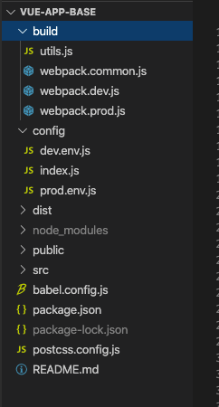

# 刘惠俊 Part2 模块二 模块化开发与规范化标准 作业

## 一、简答题

### 1、Webpack 的构建流程主要有哪些环节？如果可以请尽可能详尽的描述 Webpack 打包的整个过程。
+ 答：webpack 是一个现代 JavaScript 应用程序的静态模块打包器(module bundler)。当 webpack 处理应用程序时，它会递归地构建一个依赖关系图(dependency graph)，其中包含应用程序需要的每个模块，然后将所有这些模块打包成一个或多个 bundle。在介绍 webpack 的构建流程前，你需要先理解四个核心概念：
  + 入口(entry)： 入口起点(entry point)指示 webpack 应该使用哪个模块，来作为构建其内部依赖图的开始。进入入口起点后，webpack 会找出有哪些模块和库是入口起点（直接和间接）依赖的
  + 输出(output)：output 属性告诉 webpack 在哪里输出它所创建的 bundles，以及如何命名这些文件，默认值为 ./dist。基本上，整个应用程序结构，都会被编译到你指定的输出路径的文件夹中。
  + loader：loader 让 webpack 能够去处理那些非 JavaScript 文件（webpack 自身只理解 JavaScript）。loader 可以将所有类型的文件转换为 webpack 能够处理的有效模块，然后你就可以利用 webpack 的打包能力，对它们进行处理
  + 插件(plugins)：loader 被用于转换某些类型的模块，而插件则可以用于执行范围更广的任务。插件的范围包括，从打包优化和压缩，一直到重新定义环境中的变量。插件接口功能极其强大，可以用来处理各种各样的任务
构建的流程是：在 webpack 的配置文件中导出一个对象，这个对象包含 entry、output、module、plugins 和 resolve 的基本属性（并不局限与这些属性）。
  + 在 module 属性中我们可以定义用哪些 loader 解析某类文件，并可以设置解析文件的范围以及解析规则。
  + 在 plugins 属性中我们可以用各种插件来打包优化和压缩，还可以定义环境变量，删除和复制文件和文件夹
+ 有了 module 和 plugins 两个属性我们就可以解析各种文件为 webpack 能理解的模块，然后根据入口文件来打包进我们代码中指定的模块中，进而输出到我们想要的目录下。

### 2、Loader 和 Plugin 有哪些不同？请描述一下开发 Loader 和 Plugin 的思路。
+ 答：
+ loader 让 webpack 能够去处理那些非 JavaScript 文件（webpack 自身只理解 JavaScript）。loader 可以将所有类型的文件转换为 webpack 能够处理的有效模块，然后你就可以利用 webpack 的打包能力，对它们进行处理
+ loader 被用于转换某些类型的模块，而插件则可以用于执行范围更广的任务。插件的范围包括，从打包优化和压缩，一直到重新定义环境中的变量。插件接口功能极其强大，可以用来处理各种各样的任务，Webpack要求插件必须是一个函数或者是一个包含apply方法的对象。通过在生命周期的钩子中挂载函数实现扩展。插件机制的是webpack一个核心特性，目的是为了增强webpack自动化方面的能力。

+ 开发Loader要专注实现资源模块的加载，从而去实现整体项目的打包。

+ loader文件markdown-loader.js：
```js
const marked = require('marked')

module.exports = source => {
  // console.log(source)
  // return 'console.log("hello")'
  const html = marked(source)
  console.log(html)
  // 两种导出方式：
  // return `module.exports=${JSON.stringify(html)}`
  return `export default ${JSON.stringify(html)}`
}
```

+ 在webpack.config.js中如何使用：
```js
module: {
    rules: [
      {
        test: /.md$/,
        use: ['html-loader', './markdown-loader.js']
      }
    ]
  }
```

+ 开发Plugin是为了解决除了资源加载以外的其他的一些自动化工作。

+ 开发的插件可以是一个函数或者是一个包含apply方法的对象：
```js
class MyPlugin {
  apply (compiler) {
    console.log('MyPlugin 启动')
    compiler.hooks.emit.tap('MyPlugin', compilation => {
      // compilation 可以理解为此次打包的上下文
      for (const name in compilation.assets) {
        // console.log(name) // 文件名
        console.log(compilation.assets[name].source())
        if(name.endsWith('.js')) {
          const contents = compilation.assets[name].source()
          const withoutComments = contents.replace(/\/\*\*+\//g, '')
          compilation.assets[name] = {
            source: () => withoutComments,
            size: () => withoutComments.length
          }
        }
      }
    })
  }
}
```
+ 如何使用自定义插件：
```js
plugins: [
  new MyPlugin()
]
```

## 二、编程题
### 1、使用 Webpack 实现 Vue 项目打包任务
+ 答：
+ package.json文件如下：
```js
{
    "name": "vue-app-base",
    "version": "0.1.0",
    "private": true,
    "scripts": {
        "serve": "webpack-dev-server --config build/webpack.dev.js",
        "build": "webpack --config build/webpack.prod.js",
        "lint": "eslint --ext js,vue src"
    },
    "dependencies": {
        "-": "0.0.1",
        "D": "^1.0.0",
        "babel-eslint": "^10.1.0",
        "core-js": "^3.6.5",
        "vue": "^2.6.11"
    },
    "devDependencies": {
        "autoprefixer": "^7.1.2",
        "babel-core": "^6.22.1",
        "babel-helper-vue-jsx-merge-props": "^2.0.3",
        "babel-loader": "^7.1.1",
        "babel-plugin-syntax-jsx": "^6.18.0",
        "babel-plugin-transform-runtime": "^6.22.0",
        "babel-plugin-transform-vue-jsx": "^3.5.0",
        "babel-preset-env": "^1.3.2",
        "babel-preset-stage-2": "^6.22.0",
        "chalk": "^2.0.1",
        "compression-webpack-plugin": "^4.0.0",
        "copy-webpack-plugin": "^4.0.1",
        "css-loader": "^0.28.0",
        "eslint": "^7.3.1",
        "eslint-plugin-vue": "^6.2.2",
        "extract-text-webpack-plugin": "^3.0.0",
        "file-loader": "^1.1.4",
        "friendly-errors-webpack-plugin": "^1.6.1",
        "html-webpack-plugin": "^2.30.1",
        "less": "^3.11.3",
        "less-loader": "^4.1.0",
        "node-notifier": "^5.1.2",
        "optimize-css-assets-webpack-plugin": "^3.2.0",
        "ora": "^1.2.0",
        "portfinder": "^1.0.13",
        "postcss-import": "^11.0.0",
        "postcss-loader": "^2.0.8",
        "postcss-url": "^7.2.1",
        "rimraf": "^2.6.0",
        "semver": "^5.3.0",
        "shelljs": "^0.7.6",
        "uglifyjs-webpack-plugin": "^1.1.1",
        "url-loader": "^0.5.8",
        "vue-loader": "^13.3.0",
        "vue-style-loader": "^3.0.1",
        "vue-template-compiler": "^2.5.2",
        "webpack": "^3.6.0",
        "webpack-bundle-analyzer": "^2.9.0",
        "webpack-dev-server": "^2.9.1",
        "webpack-merge": "^4.1.0"
    },
    "eslintConfig": {
        "root": true,
        "env": {
            "node": true
        },
        "extends": [
            "plugin:vue/essential",
            "eslint:recommended"
        ],
        "parserOptions": {
            "parser": "babel-eslint"
        },
        "rules": {}
    },
    "browserslist": [
        "> 1%",
        "last 2 versions",
        "not dead"
    ]
}

```
+ 文件目录如下：

