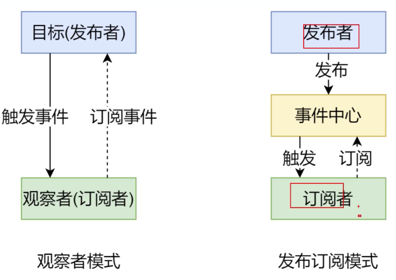
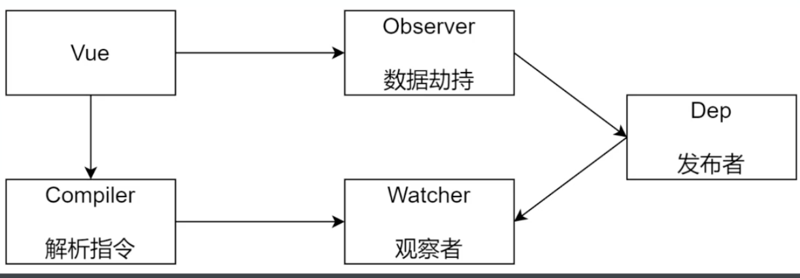
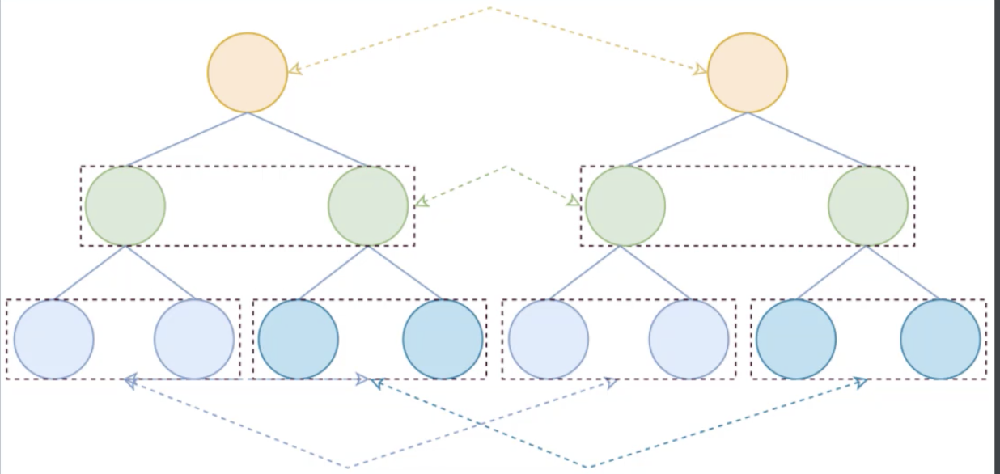

## 手写 Vue Route、手写响应式、虚拟 DOM 和 Diff 算法

### 任务二：Vue-Router 原理实现
#### 1、Vue Router 使用步骤
+ router/index.js
  + 1、注册路有插件
  ```js
  // Vue.use 是用来注册插件，他会调用传入对象的 install 方法，如果是函数就直接调用函数
  Vue.use(VueRouter);
  ```
  + 2、定义路由规则
  ```js
  const routes = [{
          path: "/",
          name: "Home",
          component: Home
      },
      {
          path: "/about",
          name: "About",
          // route level code-splitting
          // this generates a separate chunk (about.[hash].js) for this route
          // which is lazy-loaded when the route is visited.
          component: () =>
              import ( /* webpackChunkName: "about" */ "../views/About.vue")
      }
  ];
  ```
  + 3、创建 router 对象
  ```js
  const router = new VueRouter({
      routes
  });
  ```
+ main.js
  + 注册 route 对象:
  ```js
  new Vue({
    router,
    store,
    render: h => h(App)
  }).$mount("#app");
  ```
+ App.vue:
  + 创建路由组件的占位
  ```js
  <router-view />
  ```

#### 2、动态路由
+ 在 path 后加参数：
```js
// 配置动态路由参数
{
    path: "/about/:user",
    name: "About",
    // 开启 props 会把 URL 中的参数传递给组件
    // 在组件中通过 props 来接收 URL 参数
    props: true,
    // route level code-splitting
    // this generates a separate chunk (about.[hash].js) for this route
    // which is lazy-loaded when the route is visited.

    component: () =>
        import ( /* webpackChunkName: "about" */ "../views/About.vue") // 路由懒加载
}

// 获取动态路由参数
<div>
  <!-- 方式1：通过当前路由规则，获取数据 -->
  通过当前路由规则获取： {{$route.params.user}}
</div>
---
<div>
  <!-- 方式2：路由规则中开启 props 传参 -->
  通过开启 props 获取： {{user}}
</div>
<script>
export default {
  props: ['user']
}
</script>
```

#### 3、嵌套路由
+ 1、components/Layout.vue,设置 <router-view> 占位
```js
<template>
  <div>
    <div>header</div>
    <div>
      <router-view></router-view>
    </div>
    <div>footer</div>
  </div>
</template>
```
+ 2、router/index.js, routes 配置如下
```js
// 加载组件
import Layout from '@/components/Layout.vue'
import Index from '@/views/Index.vue'
import Login from '@/views/Login.vue'
// 路由规则
const routes = [
    // 嵌套路由
    {
        path: "/",

        component: Layout,
        children: [{
                name: 'index',
                path: '',
                component: Index
            },
            {
                path: "/about/:user",
                name: "About",
                // 开启 props 会把 URL 中的参数传递给组件
                // 在组件中通过 props 来接收 URL 参数
                props: true,
                // route level code-splitting
                // this generates a separate chunk (about.[hash].js) for this route
                // which is lazy-loaded when the route is visited.
                component: () =>
                    import ( /* webpackChunkName: "about" */ "../views/About.vue")
            }
        ]
    },
    {
        path: "/about/:user",
        name: "About",
        // 开启 props 会把 URL 中的参数传递给组件
        // 在组件中通过 props 来接收 URL 参数
        props: true,
        // route level code-splitting
        // this generates a separate chunk (about.[hash].js) for this route
        // which is lazy-loaded when the route is visited.
        component: () =>
            import ( /* webpackChunkName: "about" */ "../views/About.vue")
    }
];
```
#### 4、编程式导航
```js
<button @click="push"> push </button>
<script>
  export default {
    methods: {
      push () {
        this.$router.push({name: 'About', params: {user: 1}})
        // this.$router.push('/')
        // this.$router.push({name: 'Index'})
      }
    }
  }
</script>
```
#### 5、Hash 模式和 History 模式
+ 表现形式的区别
  + hash 模式
    + https://music.163.com/#/playlist?id=3102961863
  + history 模式
    + https://music.163.com/playlist/3102961863
+ 原理的区别
  + hash 模式是基于锚点，以及 onhashchange 事件
  + history 模式是基于 html5 中的 history Api
    + history.pushState()   IE10 以后才支持
    + history.replaceState()
+ 设置 history 模式
```js
const router = new VueRouter({
  mode: 'history',
  routes
})
```
#### 6、vue-router 实现原理
+ Hash 模式
  + URL 中 # 后面的内容作为路劲地址
  + 监听 hashchange 事件
  + 根据当前路由地址找到对应组件重新渲染
+ History 模式
  + 通过 history.pushState() 方法改变地址栏，并不向服务器发送请求（ push 方法会向服务器发送请求）
  + 监听 popstate 事件（ 注意：pushstate 和 replaceState 方法时不会触发）
  + 根据当前路由地址找到对应组件重新渲染

#### 7、VueRouter实现
+ 代码见 ../code/router


### 任务三、模拟 Vue.js 响应式原理
#### 1、准备工作
+ 1)、数据驱动：
  + 数据响应式：
    + 数据模型仅仅是普通的 javascript 对象，而当我们修改数据时，视图会进行更新，避免了繁琐的 DOM 操作，提高开发效率
  + 双向绑定：
    + 数据改变，视图改变；视图改变，数据也随之改变
    + 我们可以使用 v-model 在表单元素上创建双向数据绑定
  + 数据驱动是 vue 最独特的特性之一
    + 开发过程中仅需要关注数据本身，不需要关心数据是如何渲染视图
+ 2)、响应式的核心原理
  + vue2的代码实现见 ../code/defineProperty/vue2.html
  + vue3的代码实现见  ../code/defineProperty/vue3.html
+ 3)、发布订阅模式和观察者模式
  + 发布订阅模式
    + 我们假定，存在一个“信号中心”，某个任务执行完成，就向信号中心“发布”（publish）一个信号，其他任务可以向信号中心“订阅”（subscribe）这个信号，从而知道什么时候自己可以开始执行。这就叫做“发布/订阅模式”
    + 代码见 ../code/eventEmitter/eventEmitter.html
  + 观察者模式
    + 观察者（订阅者） -- Watcher
      + update():当事件发生时，具体要做的事情
    + 目标（发布者） -- Dep
      + subs 数组：存储所有的观察者
      + addSub()：添加观察者
      + notify()：当事件发生，调用所有观察者的 update() 方法
    + 没有事件中心
    + + 代码见 ../code/eventEmitter/Watcher.html
+ 4)、总结：
  + 观察者模式是由具体目标调度，比如当事件触发，Dep 就会去调用观察者的方法，所以观察者模式的订阅者与发布者之间是存在依赖的
  + 发布订阅模式由统一调度中心调用，因此发布者与订阅者不需要知道对方的存在

#### 2、自己动手实现个 minVue
+ 1）、整体分析
  + Vue 基本结构
  + 打印 Vue 实例观察
  + 整体结构
  + 
+ Vue 
  + 把 data 中的成员注入到 Vue 实例，并且把 data 中的成员转成 getter/setter
  + 功能：
    + 负责接收初始化的参数（选项）
    + 负责把 data 中的属性注入到 Vue 实例，转换成 getter/setter，见代码 ../code/minVue/vue.js
    + 负责调用 observer 监听 data 中所有属性的变化  见代码 ../code/minVue/observer.js
      + Observer
        + 能够对数据对象的所有属性进行监听，如有变动可拿到最新值并通知 Dep
        + 功能：
          + 负责把 data 选项中的属性转换成响应式数据
          + data 中的某个属性也是对象，把该属性转换成响应式数据
          + 数据变化发送通知
    + 负责调用 compiler 解析指令/插值表达式
      + 功能
        + 负责编译模板，解析指令插值表达式
        + 负责页面的首次渲染
        + 当数据变化后重新渲染视图
    + Dep类
      + 功能
        + 收集依赖，添加观察者（watcher)
        + 通知所有观察者
    + Watcher类
      + 当数据变化触发依赖，dep 通知所有的 watcher 实例更新视图
      + 自身实例化的时候往 dep 对象中添加自己

### 任务四、虚拟DOM的实现原理
#### 1、什么是 Virtual DOM
+ Virtual DOM 是有普通的 JS 对象来描述 DOM 对象，因为不是真实的 DOM 对象，所以叫 Virtual DOM 
#### 2、为什么使用虚拟DOM
+ 手动操作 DOM 比较麻烦，还需要考虑浏览器兼容性问题，虽然有 jQuery 等库简化 DOM 操作，但是随着项目的复杂 DOM 操作复杂提升
+ 为了简化 DOM 的复杂操作于是出现了各种 MVVM 框架， MVVM框架解决了视图和状态的同步问题
+ 为了简化视图的操作我们可以使用模板引擎，但是模板引擎没有解决跟踪状态变化的问题，于是 Virtual DOM 出现了
+ Vitural DOM 的好处是当状态改变时不需要立即更新 DOM，只需要创建一个虚拟 DOM 树来描述 DOM， Virtual DOM 内部将弄清楚如何有效（diff) 的跟新 DOM
+ 参考 github 上 virtual-dom 的描述
  + 虚拟 DOM 可以维护程序的状态，跟踪上一次的状态
  + 通过比较前后两次状态的差异来更新真实 DOM
#### 3、虚拟 DOM 的作用和虚拟 DOM 库
+ 虚拟 DOM 的作用
  + 维护视图和状态的关系
  + 复杂视图情况下提升渲染性能
  + 除了渲染 DOM 以外，还可以实现 SSR（Nuxt.js/Next.js）、原生应用（Weex/React Native）、小程序（mpvue/uni-app）等
+ Virtual DOM 库
  + Snabbdom 
    + Vue 2.x 内部使用的 Virtual DOM 就是改造的 Snabbdom
    + 大约 200 SLOC （single line of code）
    + 通过模块可扩展
    + 源码使用 TypeScript 开发
    + 最快的 Virtual DOM 之一
  + virtual-dom

#### 4、snabbdom 代码演示
+ 代码见 ../code/snabbdom-demo

#### 5、模块
+ Snabbdom 的核心库并不能处理元素的属性/样式/事件等，如果需要处理的话，可以使用模块
+ 常用模块（官方提供了 6 个模块）
  + attributes
    + 设置 DOM 元素的属性，使用 setAttribute()
    + 处理布尔类型的属性
  + props
    + 和 attributes 模块相似，设置 DOM 元素的属性 element[attr] = value
  + class
    + 切换样式
    + 注意：给元素设置样式是通过 sel 选择器
  + dataset
    + 设置 data-* 的自定义属性
  + eventlisteners
    + 注册和移除事件
  + style
    + 设置行内样式，支持动画
    + delayed/remove/destroy
+ 代码见 ../code/snabbdom-demo

#### 6、Snabbdom 源码解析
+ 如何学习源码
  + 先宏观了解
  + 带着目标看源码
  + 看源码的过程要不求甚解
  + 调试
  + 参考资料
+ Snabbdom 的核心
  + 使用 h() 函数创建 javascript 对象 （VNode）描述真实 DOM
  + init() 设置模块，创建 patch()
  + patch()比较新旧两个 VNode
  + 把变化的内容更新到真实 DOM 树上
+ Snabbdom 源码
  + 源码地址：https://github.com/snabbdom/snabbdom

#### 7、h 函数
+ h() 函数介绍
  + 在使用 Vue 的时候见过 h() 函数
  ```js
  new Vue({
    router,
    store,
    render: h => h(App)
  }).$mount('#app')
  ```
  + h() 函数最早见于 hyperscript，使用 javascript 创建超文本
  + Snabbdom 中的 h() 函数不是用来创建超文本，而是创建 VNode
+ 函数重载
  + 概念
    + 参数个数 或 类型 不同的函数
    + JavaScript 中没有重载的概念
    + Typescript 中有重载，不过重载的实现还是通过代码调整参数
    + 重载的示意
    ```js
    function add (a, b) {
    console.log(a + b)
    }
    function add (a, b, c) {
    console.log(a+b+c)
    }
    add(1,2)
    add(1,2,3)
    ```
+ 源码位置：src/h.ts
```js
export function h(sel: string): VNode;
export function h(sel: string, data: VNodeData): VNode;
export function h(sel: string, children: VNodeChildren): VNode;
export function h(sel: string, data: VNodeData, children: VNodeChildren): VNode;
export function h(sel: any, b?: any, c?: any): VNode {
  var data: VNodeData = {}, children: any, text: any, i: number;
  if (c !== undefined) {
    data = b;
    if (is.array(c)) { children = c; }
    else if (is.primitive(c)) { text = c; }
    else if (c && c.sel) { children = [c]; }
  } else if (b !== undefined) {
    if (is.array(b)) { children = b; }
    else if (is.primitive(b)) { text = b; }
    else if (b && b.sel) { children = [b]; }
    else { data = b; }
  }
  if (children !== undefined) {
    for (i = 0; i < children.length; ++i) {
      if (is.primitive(children[i])) children[i] = vnode(undefined, undefined, undefined, children[i], undefined);
    }
  }
  if (
    sel[0] === 's' && sel[1] === 'v' && sel[2] === 'g' &&
    (sel.length === 3 || sel[3] === '.' || sel[3] === '#')
  ) {
    addNS(data, children, sel);
  }
  return vnode(sel, data, children, text, undefined);
};
```
#### 8、patch的整体过程
+ snabbdom
  + patch(oldVnode, newVnode)
  + 打补丁，把新节点中变化的内容渲染到真实 DOM，最后返回新节点作为下一次处理的旧节点
  + 对比新旧 VNode 是否相同节点（节点的 key 和 set 相同）
  + 如果不是相同节点，删除之前的内容，重新渲染
  + 如果是相同的节点，再判断新的 VNode 是否有 text，如果有并且和 oldVnode 的 text 不同，直接更新文本内容
  + 如果新的 VNode 有 children，判断子节点是否有变化，判断子节点的过程使用的就是 diff 算法
  + diff 过程只进行同层级比较
  + 


