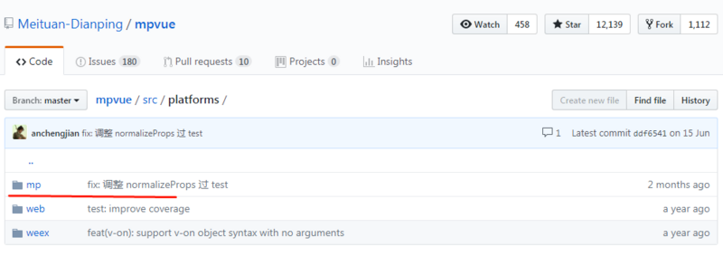
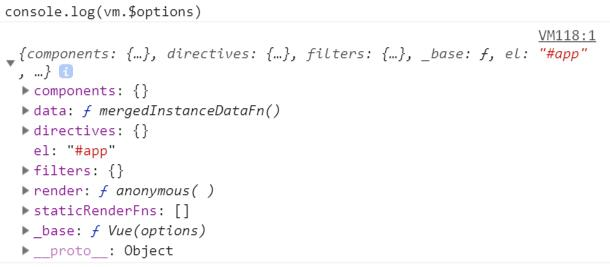

## 准备工作
  + 1、从GitHub上面下载vue的源码（https://github.com/vuejs/vue）
  + 2、了解下Flow,Flow 是 facebook 出品的 JavaScript 静态类型检查工具。Vue.js 的源码利用了 Flow 做了静态类型检查
  + 3、vue.js 源码目录设计,vue.js的源码都在 src 目录下(\vue-dev\src)
    src
    ├── compiler # 编译相关
    ├── core # 核心代码
    ├── platforms # 不同平台的支持
    ├── server # 服务端渲染
    ├── sfc # .vue 文件解析
    ├── shared # 共享代码
    + core 目录：包含了 Vue.js 的核心代码，包括内置组件、全局 API 封装，Vue 实例化、观察者、虚拟 DOM、工具函数等等。这里的代码可谓是 Vue.js 的灵魂
    + platform目录：Vue.js 是一个跨平台的 MVVM 框架，它可以跑在 web 上，也可以配合 weex 跑在 natvie 客户端上。platform 是 Vue.js 的入口，2 个目录代表 2 个主要入口，分别打包成运行在 web 上和 weex 上的 Vue.js。比如现在比较火热的mpvue框架其实就是在这个目录下面多了一个小程序的运行平台相关内容。
    + 
    + vue2.0的生命周期分为4主要个过程:
      + 4.1 create:创建---实例化Vue(new Vue) 时，会先进行create。
      + 4.2 mount:挂载---根据el, template, render方法等属性，会生成DOM，并添加到对应位置。
      + 4.3 update:更新---当数据发生变化后，更新DOM。
      + 4.4 destory:销毁---销毁时执行

## new Vue()发生了什么
  + 在 vue 的生命周期上第一个就是 new Vue() 创建一个 vue 实例出来，对应到源码在 /vue-dev/srv/core/instance/index.js
  ```js
  import { initMixin } from './init'
  import { stateMixin } from './state'
  import { renderMixin } from './render'
  import { eventsMixin } from './events'
  import { lifecycleMixin } from './lifecycle'
  import { warn } from '../util/index'

  /*Vue的构造函数,options是我们在new Vue({}) 传递进来的一个对象*/
  function Vue (options) {
      /*进行了Vue函数调用的安全监测*/
      /*Vue的构造函数只能通过new Vue()来调用*/
      /*不能通过 Vue()调用, 这样调用 this指向window*/
      if (!(this instanceof Vue)) {
          /*封装了warn函数,  用于报错提示信息等*/
          warn('Vue is a constructor and should be called with the `new` keyword');
      }
      /* 调用原型上的_init方法, 进行初始化  */
      this._init(options);
  }

  initMixin(Vue)
  stateMixin(Vue)
  eventsMixin(Vue)
  lifecycleMixin(Vue)
  renderMixin(Vue)

  export default Vue
  ```
  + 可以通过 index.js 中的代码看到，其实就是一个 function，在 es5 中实现 class 的方式，在 function vue 中还加入了 if 判断，表示 vue 必须通过 new 关键字进行实例化。这里有个疑问就是为什么 vue 中没有使用 es6 的 class 方式进行定义？通过看下面的方法可以得到解答。

  + function vue 下定义了许多 Mixin 这种方法，并且把 vue 类当做参数传递进去，下面来进入 initMixin(Vue) 下，来自 import { initMixin } from './init'，代码如下：
  ```js
    var uid$3 = 0; /* 用于统计 Vue 构造函数被 new 多少次*/
    /* initMixin 主要是对 options 选项的合并和规范*/
    function initMixin (Vue) {
        Vue.prototype._init = function (options) {
            var vm = this;
            /* 统计 Vue 被 new 了多少次*/
            vm._uid = uid$3++;
            var startTag, endTag;
            /* istanbul ignore if */
            if (config.performance && mark) {
                startTag = "vue-perf-start:" + (vm._uid);
                endTag = "vue-perf-end:" + (vm._uid);
                mark(startTag);
            }
            /*设置了一个标识, 避免被 vm 实例加入响应式系统 */
            vm._isVue = true;
            /*合并选项*/
            if (options && options._isComponent) {
                // optimize internal component instantiation
                // since dynamic options merging is pretty slow, and none of the
                // internal component options needs special treatment.
                initInternalComponent(vm, options);
            } else {
                /*选项合并的入口代码*/
                vm.$options = mergeOptions(
                    resolveConstructorOptions(vm.constructor),
                    options || {},
                    vm
                );
            }
            /* istanbul ignore else */
            {
                initProxy(vm); /*初始化Proxy, 检测ES6的Proxy函数是否支持等*/
            }
            // expose real self
            vm._self = vm;
            initLifecycle(vm);  /* 初始时生命周期*/
            initEvents(vm); /* 初始化事件*/
            initRender(vm);  /* 渲染页面 */
            callHook(vm, 'beforeCreate');   /*生命周期钩子函数beforeCreate被的调用*/
            initInjections(vm); // resolve injections before data/props
            initState(vm);    /*初始化状态 props data computed watch methods*/
            initProvide(vm); // resolve provide after data/props
            callHook(vm, 'created');   /*生命周期钩子函数created被的调用*/

            /* istanbul ignore if */
            if (config.performance && mark) {
                vm._name = formatComponentName(vm, false);
                mark(endTag);
                measure(("vue " + (vm._name) + " init"), startTag, endTag);
            }
            /*如果配置了el选项, 去挂载*/
            if (vm.$options.el) {
                vm.$mount(vm.$options.el);
            }
        };
    }
  ```
  + 可以看到 initMixin 方法就是往 vue 的原型上挂载了一个 _init 方法，其他的 Mixin 也是同理，都是往 vue 的原型上挂载各种方法，而最开始创建 vue 类时通过 es5 function 的方式创建也是为了后面可以更加灵活操作，可以将方法写入到各个 js 文件，不用一次写在一个文件下面，更加方便代码后期的维护，这个也是选择 es5 创建的原因。
  + 当调用 new Vue 的时候，事实上就调用的 Vue 原型上的 _init 方法
  + _init 函数的流程:
    + 最重要的事情 mergeOptions() 函数, 进行选项的合并和规范化
    + 初始化页面, 初始化事件, 渲染页面, 初始化 data、props、computed、watcher 等等

## mergeOptions选项合并策略
  + mergeOptions的主要作用:
    + 对 options 进行规范
    + options 的合并, 默认策略和自定义策略
  + 合并策略目的:围绕着组件和子类来进行限制的
    ```js
    const vm= new Vue({
        el:"#app",
        data:{
            test:"这是一个测试"
        }
    })
    ```
  + 当在控制台打印 vm.$options 可以看到多了几个属性
  + 
  + Vue.js 在初始化的时候，有些默认的配置，initGlobalAPI 函数为 Vue.options 进行了一些初始化的默认配置
    ```js
    function initGlobalAPI(Vue) {
        ...
        Vue.options = Object.create(null);
        /*对资源assets的默认初始化*/
        ASSET_TYPES.forEach(function (type) {
            Vue.options[type + 's'] = Object.create(null);
        });

        // this is used to identify the "base" constructor to extend all plain-object
        // components with in Weex's multi-instance scenarios.
        Vue.options._base = Vue;

        extend(Vue.options.components, builtInComponents);
        ...
    }
    ```
  + 在上一节 vm._init 函数中，调用了 mergeOptions 函数，进行选项的合并
    ```js
    function initMixin(Vue) {
        Vue.prototype._init = function (options) {
            var vm = this;
            ...
            // merge options
            if (options && options._isComponent) {
                // optimize internal component instantiation
                // since dynamic options merging is pretty slow, and none of the
                // internal component options needs special treatment.
                initInternalComponent(vm, options);
            } else {
                /*
                * 在这个调用了mergeOptions函数
                * 获取resolveConstructorOptions(vm.constructor)返回值
                */
                vm.$options = mergeOptions(resolveConstructorOptions(vm.constructor), options || {}, vm)
            }
            ...
        };
    }
    ```
  + 接下来看 mergeOptions 函数的实现：
    ```js
    /* 用于把 parent, child 进行合并 */
    function mergeOptions(parent, child, vm) {
      /*检测 options 里,组件的名字命名规范*/
        {
            checkComponents(child);
        }
        /* child 也可以是是一个函数*/
        if (typeof child === 'function') {
            child = child.options;
        }
        /*规范化 Props */
        normalizeProps(child, vm);
        /*规范化 Inject */
        normalizeInject(child, vm);
        /*规范化 Directives */
        normalizeDirectives(child);

        // Apply extends and mixins on the child options,
        // but only if it is a raw options object that isn't
        // the result of another mergeOptions call.
        // Only merged options has the _base property.
        if (!child._base) {
            if (child.extends) {
                /*递归调用把 extends 合并到 parent 上*/
                parent = mergeOptions(parent, child.extends, vm);
            }
            if (child.mixins) {
                /*递归调用把 mixins 合并到 parent 上*/
                for (var i = 0, l = child.mixins.length; i < l; i++) {
                    parent = mergeOptions(parent, child.mixins[i], vm);
                }
            }
        }
        /*最终合并完成要返回的 $options, vm.$options 对象*/
        var options = {};
        var key;
        for (key in parent) {  /*先判断 parent 上是否存在 key*/
            mergeField(key);
        }
        for (key in child) {
            if (!hasOwn(parent, key)) { /*判断 parent 以后,在判断 child 是上否有 key */
                mergeField(key);
            }
        }
        /* 合并字段 */
        function mergeField(key) {
            /*根据不同的 */
            var strat = strats[key] || defaultStrat;
            options[key] = strat(parent[key], child[key], vm, key);
        }
        /*返回最终合并完成的 options, 会赋值给 Vue.$options */
        return options
    }
    ```
  + 通过分析 mergeOptions 函数，主要做了以下几件事情：
    + 检查组件的命名是否规范
    + 规范化 Props，Inject，Directives
    + Vue 选项的合并
  + mergeOptions 的第三个参数 vm，用于区分是根实例还是子组件。在上面的代码中，传递了 vn 的参数
  + mergeOptions 在另一个函数中也被调用了，在 Vue.extend() 这个函数中，没有传递 vm 参数

  ##### 检查组件的命名是否规范 checkComponents(child)
  ```js
  function checkComponents(options) {
    for (var key in options.components) {
        validateComponentName(key);
    }
  }
  ```
  + 将 child 传递进来，进行遍历，获取到每个 key。将每个 key 作为参数传递给 vaildateComponentName(key)
  ```js
  function validateComponentName(name) {
      if (!new RegExp(("^[a-zA-Z][\\-\\.0-9_" + unicodeLetters + "]*$")).test(name)) {
          warn(
              'Invalid component name: "' + name + '". Component names ' +
              'should conform to valid custom element name in html5 specification.'
          );
      }
      if (isBuiltInTag(name) || config.isReservedTag(name)) {
          warn(
              'Do not use built-in or reserved HTML elements as component ' +
              'id: ' + name
          );
      }
  }
  ```
  + isBuiltInTag 函数，不能是 slot，component 等 Vue 的内置组件的名字
  ```js
  var isBuiltInTag = makeMap('slot, component', true)
  ```
  + isReservedTag 函数，组件的名字不能为 html 标签的名字和 svg 标签的名字
  ```js
  var isReservedTag = function (tag) {
    return isHTMLTag(tag) || isSVG(tag)
  }
  ```
  + 从 validateComponentName 分析得出组件的命名规范应该满足一下的要求:
    + /^[a-zA-Z][-.0-9_/.test(name) 为 true
    + isBuiltInTag(name) 或者 config.isReservedTag(name) 为 false
  +  #### Vue 选项的合并  


